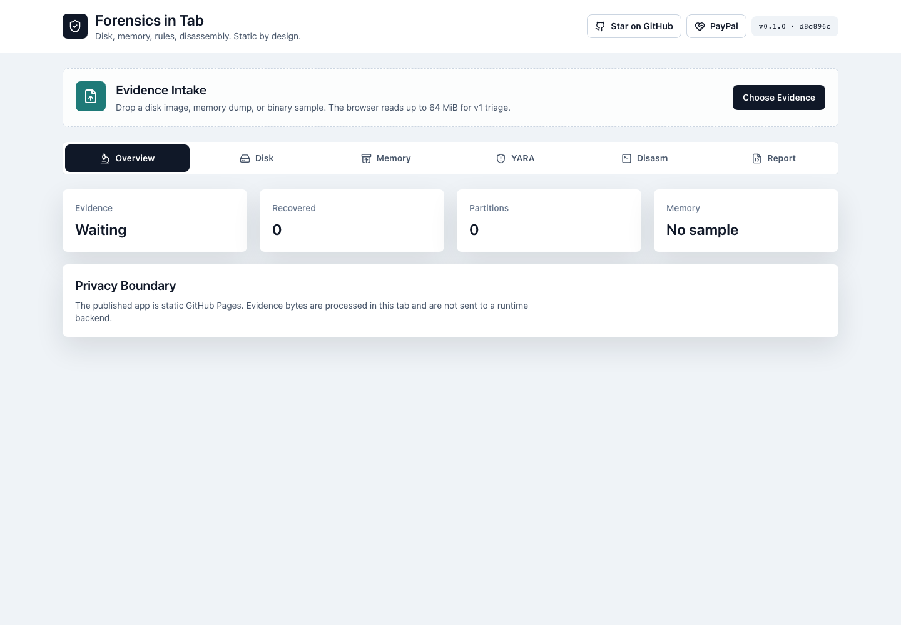
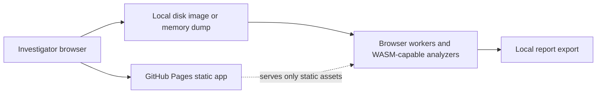

# Forensics in Tab

[](https://baditaflorin.github.io/forensics-in-tab/)
[](docs/adr/0001-deployment-mode.md)

Browser-only forensic triage for disk images, memory dumps, YARA rules, and disassembly without uploading evidence.

Live site: https://baditaflorin.github.io/forensics-in-tab/

Repository: https://github.com/baditaflorin/forensics-in-tab

Support: https://www.paypal.com/paypalme/florinbadita



## Verified Features

- Multi-file file-picker and drag-drop intake
- Paste intake for text, hex, and base64
- Sample evidence loader for first-run exploration
- Local case queue with per-item type override
- Disk carving and partition triage on the active evidence item
- Memory IOC extraction and PE hint triage
- Local YARA subset scanning with reusable rules
- Capstone-backed disassembly with CSV export
- JSON report export, clipboard copy, print view, and restorable session export
- Browser-local case restore with IndexedDB and shareable URL hashes for small sessions

## Quickstart

```sh
npm install
make install-hooks
make dev
make test
make build
```

## Architecture

Forensics in Tab is a pure GitHub Pages app. Evidence files are read by the browser, analyzed locally, and never sent to a server. Optional resume-later persistence stays in the same browser through IndexedDB; there is still no runtime backend.



## Documentation

Architecture: https://github.com/baditaflorin/forensics-in-tab/blob/main/docs/architecture.md

Deployment: https://github.com/baditaflorin/forensics-in-tab/blob/main/docs/deploy.md

Privacy: https://github.com/baditaflorin/forensics-in-tab/blob/main/docs/privacy.md

ADRs: https://github.com/baditaflorin/forensics-in-tab/tree/main/docs/adr

Postmortem: https://github.com/baditaflorin/forensics-in-tab/blob/main/docs/postmortem.md

Phase 3 postmortem: https://github.com/baditaflorin/forensics-in-tab/blob/main/docs/postmortem-phase3.md

## Limitations

- The app samples up to 64 MiB per evidence item for browser-local triage.
- Shareable URLs are only practical for small sessions; larger cases should use session export.
- URL-based remote evidence intake is intentionally out of scope in Mode A because CORS and remote fetching would imply a workflow the static app cannot guarantee.

## License

MIT
