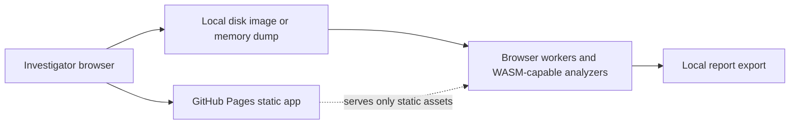

# Forensics in Tab

[](https://baditaflorin.github.io/forensics-in-tab/)
[](docs/adr/0001-deployment-mode.md)

Browser-only forensic triage for disk images, memory dumps, YARA rules, and disassembly without uploading evidence.

Live site: https://baditaflorin.github.io/forensics-in-tab/

Repository: https://github.com/baditaflorin/forensics-in-tab

Support: https://www.paypal.com/paypalme/florinbadita

## Quickstart

```sh
npm install
make install-hooks
make dev
make test
make build
```

## Architecture

Forensics in Tab is a pure GitHub Pages app. Evidence files are read by the browser, analyzed locally, and never sent to a server.



## Documentation

Architecture: docs/architecture.md

Deployment: docs/deploy.md

Privacy: docs/privacy.md

ADRs: docs/adr/

## License

MIT
