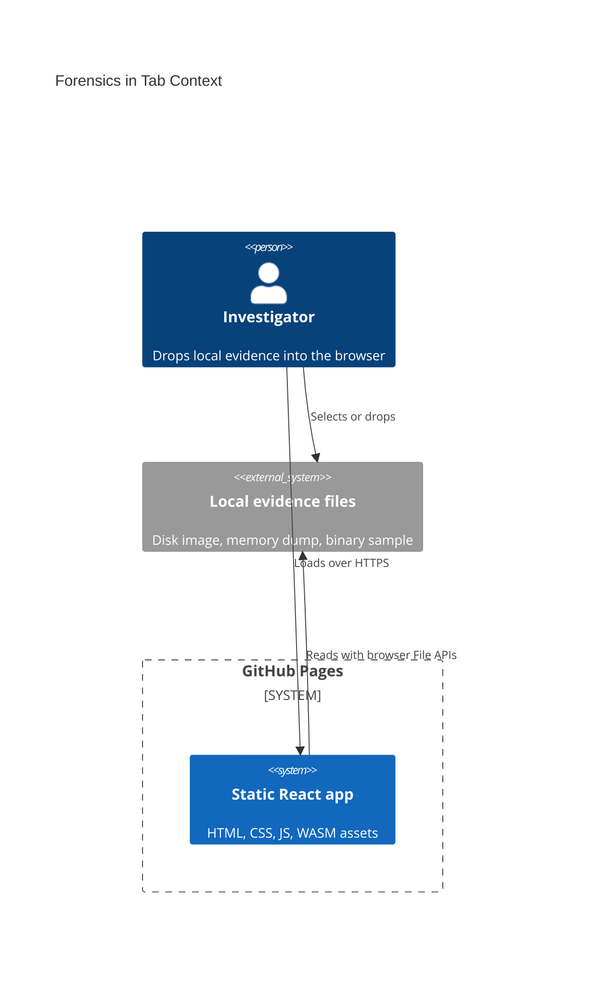
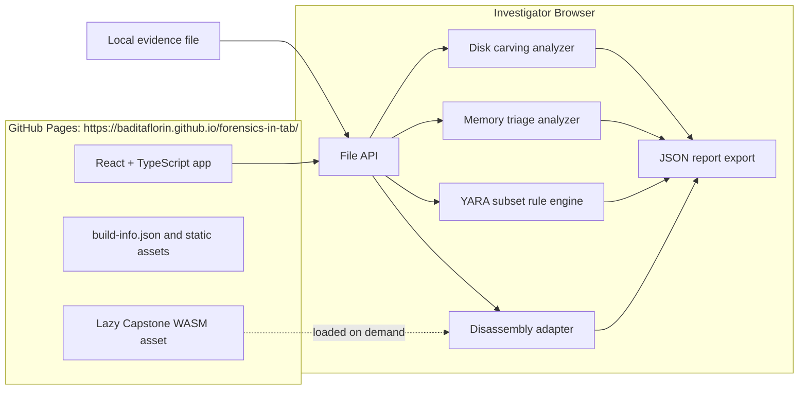

# Architecture

Forensics in Tab is a Mode A GitHub Pages application. The browser is the execution boundary for evidence handling.

Live site: https://baditaflorin.github.io/forensics-in-tab/

Repository: https://github.com/baditaflorin/forensics-in-tab

## Context

## Container

## Boundaries

Evidence bytes do not leave the browser. There is no runtime API, auth service, database, telemetry endpoint, Docker backend, or server-side worker in v1.

## Module Map

- `src/features/evidence/`: file intake, hashing, metadata.
- `src/features/disk/`: MBR parsing and signature-based carving.
- `src/features/memory/`: strings, IOC extraction, PE hints, entropy hotspots.
- `src/features/yara/`: local YARA-compatible subset parser and evaluator.
- `src/features/disasm/`: Capstone WASM adapter with x86 fallback.
- `src/features/report/`: JSON report assembly and export.
